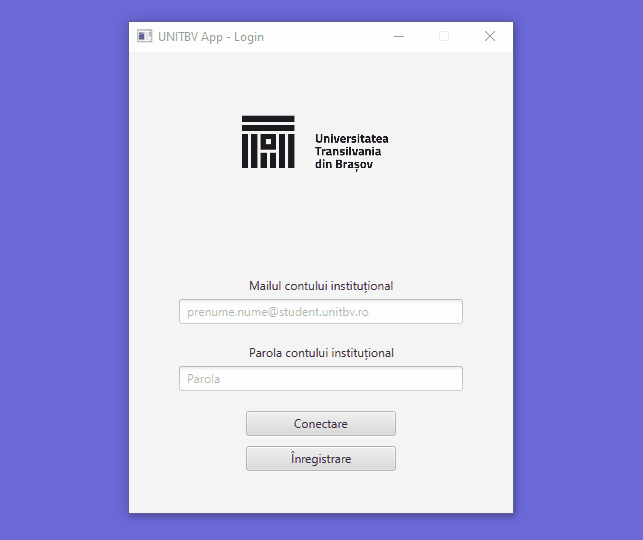
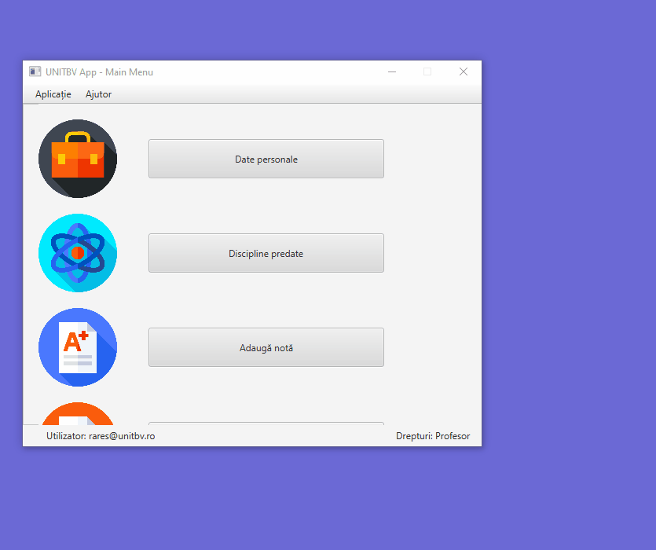
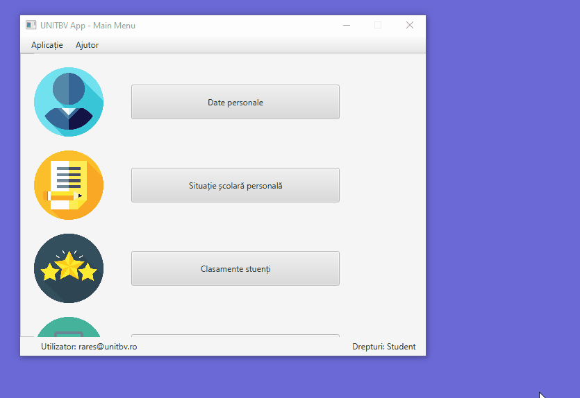
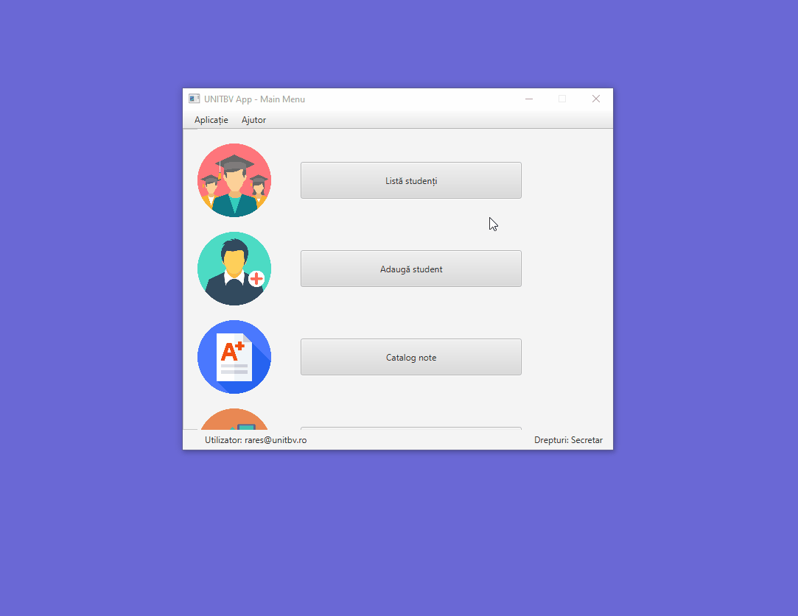
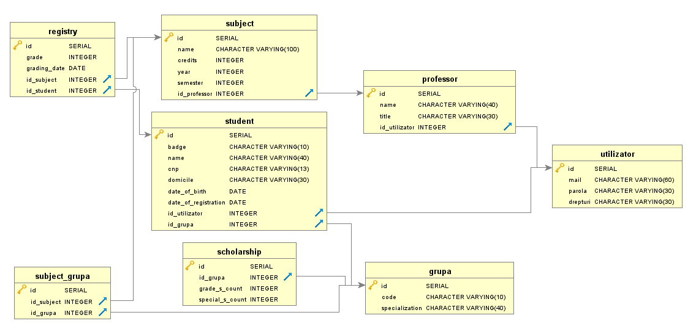
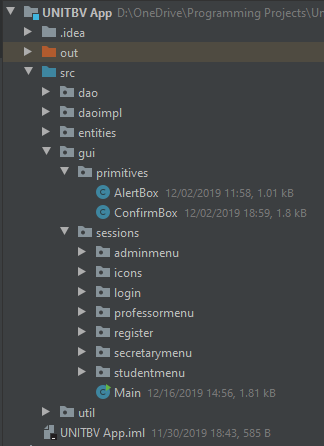

# MIP (Programming Environments and Tools) 2019 Project

## General information
This is an application realized using JavaFX for the "Programming Environments and Tools" subject project in my second university year at Transylvania University of Brașov, Romania (2019).

## Purpose
The purpose was to realize a desktop application meant to handle most of the general functionalities needed into an university by a student, professor, secretary and administrator (ie. managing grades, seeing personal info, offering scholarships, etc.). For this project Java language was a requirement. We also needed to use a database provider in order to ensure persistency.

## Showcase
| **Login View**| **Professor View**|
|:-:|:-:|
| **Student View**| **Secretary View**|

## Implementation
### Database
 

### Project structure
 
- **dao & daoimpl**: Data Access Object interfaces and implementations
- **entities**: entities/models of the project
- **gui**: gui elements
	- **primitives**: primitive components like alert boxes, dialogs, etc.
	- **view.fxml**: the proper views (as .fxml files)
	- **controller.java**: classes that control behavior and handle view events
	- **icons**: icons used in the GUI (as .png files)
- **util**: auxiliary classes that handle connections, authentication, etc.

## Technologies
- **IntelliJ**: IDE
- **JavaFX**: GUI framework
- **SceneBuilder**: for editing FXML view files
- **PostgreSQL**: database provider used
